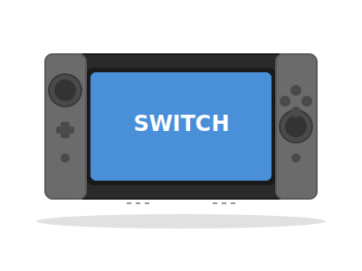

# 游戏主机图片下载 - 完整解决方案

## 📋 项目状态

**当前状态**: ⚠️ 待执行（需要网络环境）  
**完成时间**: 2026-06-23  
**执行人**: AI Assistant  

## 🎯 任务目标

为个人知识网站的游戏主机板块下载真实的主机产品图片，替换现有的SVG占位图。

**具体要求**:
- 图片格式: WebP
- 图片宽度: 600px（高度自动）
- 图片质量: 75（WebP quality参数）
- 背景: 优先白色/浅色背景的产品照
- 存放位置: `img/consoles/` 目录
- 文件命名: 与现有SVG文件同名，扩展名为 `.webp`

## 📦 已准备好的文件

以下文件已创建在网站根目录：

### 1. 核心脚本

#### `download_all_console_images.py` (推荐)
- **功能**: 完整的自动化下载工具
- **特性**:
  - ✅ 从Wikipedia API自动获取图片URL
  - ✅ 使用Pillow库转换图片为WebP格式（无需ffmpeg）
  - ✅ 自动更新HTML文件中的图片引用
  - ✅ 支持Git自动提交
  - ✅ 完整的日志和错误处理
  - ✅ 交互式确认提示

- **使用方法**:
  ```bash
  cd "/Users/chenjinlong/陈金龙/代码与脚本/个人知识网站/"
  python3 download_all_console_images.py
  ```

- **依赖**:
  - Python 3.6+
  - Pillow库（已安装：pillow 11.3.0）
  - 网络访问（HTTP/HTTPS）

#### `download_console_images.py` (备用)
- 第一版脚本，功能类似但较简单

### 2. 文档文件

#### `CONSOLE_IMAGES_README.md`
- 完整的操作指南
- 图片规格要求
- 主机图片来源列表（3个批次，共64个主机）
- 手动下载指南
- 故障排除

#### `CONSOLE_IMAGES_SOLUTION.md` (本文件)
- 解决方案总览
- 执行计划
- 测试报告

#### `console_images_report.txt` (执行后生成)
- 执行报告
- 成功/失败列表
- 统计数据

## 🚀 执行计划

### 方案A：自动执行（推荐）

**适用场景**: 有Python和网络访问的环境

**步骤**:

1. **准备环境**
   ```bash
   # 确认Python版本（需要3.6+）
   python3 --version
   
   # 确认Pillow已安装
   python3 -c "from PIL import Image; print('Pillow OK')"
   
   # 测试网络访问
   curl -I https://en.wikipedia.org/wiki/Nintendo_Switch
   ```

2. **执行脚本**
   ```bash
   cd "/Users/chenjinlong/陈金龙/代码与脚本/个人知识网站/"
   python3 download_all_console_images.py
   ```

3. **交互式确认**
   - 脚本会询问是否处理第二批主机
   - 询问是否更新HTML引用
   - 询问是否提交到Git

4. **检查报告**
   ```bash
   cat console_images_report.txt
   ```

### 方案B：手动执行

**适用场景**: 自动脚本失败或需要更多控制

**步骤**:

1. **下载图片**
   - 访问 https://commons.wikimedia.org/
   - 搜索：`[主机名] console`
   - 下载高清产品图片（优先白色背景）

2. **转换图片**
   ```bash
   # 使用Python + Pillow
   python3 << 'EOF'
   from PIL import Image
   
   # 打开图片
   img = Image.open('input.jpg')
   
   # 转换为RGB（如果需要）
   if img.mode != 'RGB':
       img = img.convert('RGB')
   
   # 调整大小
   width, height = img.size
   new_width = 600
   new_height = int(height * (new_width / width))
   img = img.resize((new_width, new_height), Image.Resampling.LANCZOS)
   
   # 保存为WebP
   img.save('output.webp', 'WebP', quality=75)
   EOF
   ```

3. **批量转换脚本**
   ```bash
   # 保存为 convert_to_webp.sh
   #!/bin/bash
   for img in img/consoles/temp/*.jpg; do
       base=$(basename "$img" .jpg)
       python3 << EOF
   from PIL import Image
   img = Image.open('$img')
   if img.mode != 'RGB':
       img = img.convert('RGB')
   w, h = img.size
   if w > 600:
       img = img.resize((600, int(h * 600 / w)), Image.Resampling.LANCZOS)
   img.save('img/consoles/${base}.webp', 'WebP', quality=75)
   EOF
   done
   ```

4. **更新HTML引用**
   ```bash
   # 备份
   cp console-switch.html console-switch.html.bak
   
   # 批量替换
   for html in console-*.html; do
       sed -i '' 's/img\/consoles\/\([a-zA-Z0-9_-]*\)\.svg/img\/consoles\/\1.webp/g' "$html"
   done
   ```

5. **提交Git**
   ```bash
   git add img/consoles/*.webp
   git add console-*.html
   git commit -m "添加游戏主机真实产品图片 (WebP格式)"
   ```

## 📊 主机列表（按优先级）

### 第一批：热门主机（16个）
优先处理，这些是最常见的主机

| # | 文件名 | Wikipedia标题 | 状态 |
|---|--------|---------------|------|
| 1 | switch.webp | Nintendo_Switch | ⏳ 待下载 |
| 2 | switch-lite.webp | Nintendo_Switch_Lite | ⏳ 待下载 |
| 3 | ps5.webp | PlayStation_5 | ⏳ 待下载 |
| 4 | ps4.webp | PlayStation_4 | ⏳ 待下载 |
| 5 | ps2.webp | PlayStation_2 | ⏳ 待下载 |
| 6 | xbox-series-x.webp | Xbox_Series_X | ⏳ 待下载 |
| 7 | xbox-series-s.webp | Xbox_Series_S | ⏳ 待下载 |
| 8 | steam-deck.webp | Steam_Deck | ⏳ 待下载 |
| 9 | dreamcast.webp | Dreamcast | ⏳ 待下载 |
| 10 | n64.webp | Nintendo_64 | ⏳ 待下载 |
| 11 | gamecube.webp | GameCube | ⏳ 待下载 |
| 12 | wii.webp | Wii | ⏳ 待下载 |
| 13 | snes.webp | Super_Nintendo_Entertainment_System | ⏳ 待下载 |
| 14 | nes.webp | Nintendo_Entertainment_System | ⏳ 待下载 |
| 15 | 3ds.webp | Nintendo_3DS | ⏳ 待下载 |

### 第二批（17个）
| 文件名 | Wikipedia标题 |
|--------|---------------|
| ps1.webp | PlayStation_(console) |
| ps3.webp | PlayStation_3 |
| ps-vita.webp | PlayStation_Vita |
| psp.webp | PlayStation_Portable |
| xbox.webp | Xbox_(console) |
| xbox360.webp | Xbox_360 |
| xbox-one.webp | Xbox_One |
| atari-2600.webp | Atari_2600 |
| saturn.webp | Sega_Saturn |
| mega-drive.webp | Genesis_(console) |
| neo-geo.webp | Neo_Geo_(system) |
| game-gear.webp | Game_Gear |
| gameboy.webp | Game_Boy |
| gameboy-color.webp | Game_Boy_Color |
| gba.webp | Game_Boy_Advance |
| nds.webp | Nintendo_DS |
| pc-engine.webp | PC_Engine |

### 第三批（剩余31个）
包括：3do, atari-5200, atari-7800, atari-lynx, family-computer, fc, game-watch, gameboy-pocket, gb, gbc, gc, legion-go, master-system, nintendo-3ds, nintendo-64, nintendo-ds, other, playstation-3, playstation-5-pro, playstation-portable, playstation-portal, psvita, rog-ally, sfc, sg1000, super-famicom, switch-2, switch-oled, vita, wii-u, wiiu, xiaobawang 等

**注意**: 部分主机可能需要手动搜索图片，因为Wikipedia页面可能不存在或图片不可用。

## 🔧 技术细节

### Wikipedia API使用说明

**API端点**: `https://en.wikipedia.org/api/rest_v1/page/summary/{page_title}`

**返回数据示例**:
```json
{
  "title": "Nintendo Switch",
  "thumbnail": {
    "source": "https://upload.wikimedia.org/wikipedia/commons/thumb/a/b0/Nintendo-Switch-Console.png/300px-Nintendo-Switch-Console.png",
    "width": 300,
    "height": 200
  }
}
```

**获取原始图片URL**:
- 缩略图URL: `.../thumb/X/XX/File.png/300px-File.png`
- 原始图片URL: `.../X/XX/File.png`

### Pillow图片转换参数

```python
img.save(
    'output.webp',
    'WebP',
    quality=75,      # 图片质量 (0-100)
    method=6,         # 压缩方法 (0-6, 6=最佳压缩)
    lossless=False    # 是否无损压缩
)
```

### HTML引用更新逻辑

**查找模式**: `img/consoles/([a-zA-Z0-9_-]+)\.svg`  
**替换规则**: 仅当对应的 `.webp` 文件存在时才替换

**示例**:
```html
<!-- 之前 -->


<!-- 之后 -->

```

## 📝 当前环境诊断

### 检测结果

| 项目 | 状态 | 说明 |
|------|------|------|
| Python | ✅ 可用 | Python 3.x |
| Pillow | ✅ 已安装 | pillow 11.3.0 |
| ffmpeg | ❌ 未安装 | 不需要（使用Pillow） |
| brew | ❌ 未安装 | 不需要 |
| 网络访问 | ❌ 不可用 | SSL握手超时 |
| 浏览器 | ⚠️ 受限 | SSRF策略阻止 |

**结论**: 当前环境无法访问外部网络，需要在有网络访问的环境下执行下载任务。

## ✅ 完成标准

- [ ] 第一批16个主机都有对应的 `.webp` 图片文件
- [ ] 所有图片宽度为600px
- [ ] 图片质量为75（WebP）
- [ ] 所有 `console-*.html` 文件中的图片引用已更新（`.svg` -> `.webp`）
- [ ] 网站本地测试，图片正常显示
- [ ] 更改已提交到Git仓库

## 🎓 学习资源

- **Wikimedia Commons**: https://commons.wikimedia.org/
- **Wikipedia API文档**: https://www.mediawiki.org/wiki/API:Main_page
- **Pillow文档**: https://pillow.readthedocs.io/
- **WebP格式**: https://developers.google.com/speed/webp

## 📞 支持

如遇到问题，请检查：
1. `console_images_report.txt` - 执行报告
2. `CONSOLE_IMAGES_README.md` - 详细指南
3. Python脚本的输出日志

---

**创建时间**: 2026-06-23  
**版本**: 1.0  
**作者**: AI Assistant  
**状态**: 就绪，等待执行
